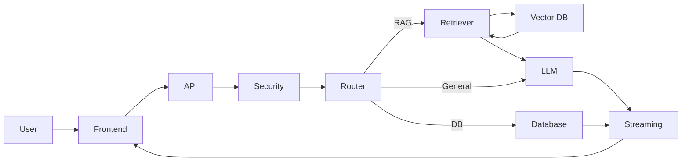
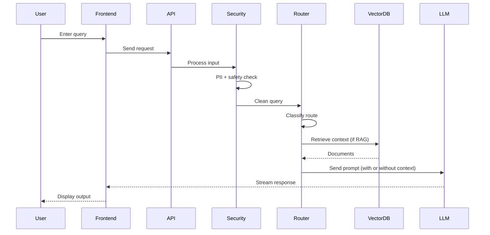

# Architecture

## Overview

The system follows a layered architecture designed for secure, real-time AI interaction with enterprise data.

## Layered Architecture Diagram

### Layers

1. Frontend (Next.js)
2. API Layer (Django ASGI)
3. Security Layer (PII + Safety Middleware)
4. Orchestration Layer (Routing + Session)
5. RAG Layer (Retrieval + Embeddings + Pinecone)
6. AI Layer (Ollama - Kimi K2.5)
7. Data Layer (Django DB + Vector DB)

---

## Data Flow

1. User sends query from frontend
2. Request hits Django API
3. Security middleware:
   - PII scrubbing (Presidio)
   - Safety classification (LLM)
4. Query routed:
   - RAG → retrieve context from Pinecone
   - General → direct LLM
   - DB → metadata lookup
5. LLM generates response (streaming)
6. Response returned as NDJSON stream
7. Frontend renders tokens in real-time

## Data and LLM Flow Diagram

---

## Key Components

- RAGOrchestrator → manages retrieval + generation
- SecurityScrubberMiddleware → input protection
- Pinecone → vector storage
- Ollama → LLM inference
- Django ORM → session + metadata

---

## Streaming Design

- NDJSON streaming via StreamingHttpResponse
- Token-level output from LLM
- Async pipeline end-to-end

---

## Design Decisions

- Async Django for performance
- Local embeddings for cost efficiency
- Cloud LLM (Kimi) for higher quality
- Guardrails applied before and after LLM
